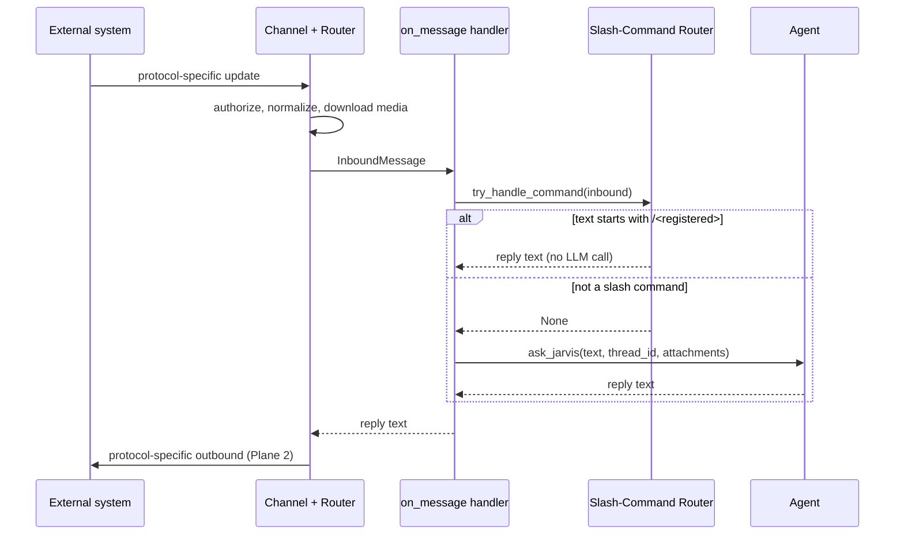
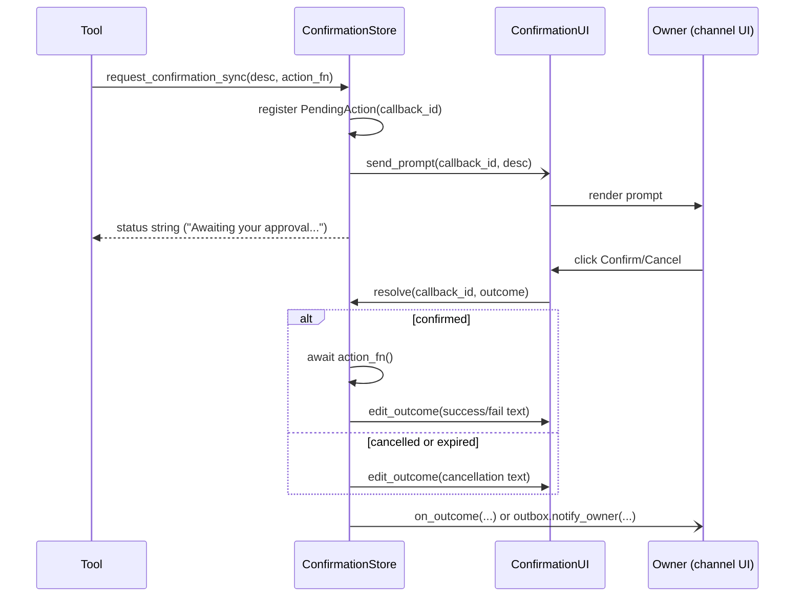

# Gateway Architecture

## Purpose

The gateway layer is the **boundary between Jarvis's domain logic and any external messaging system**. It exists to ensure that:

- Tools, the agent, and heartbeat code never know which channel a user is on.
- A new channel (email, WhatsApp, voice, custom app) is added by dropping a directory under `gateway/channels/<channel>/` — no edits to tools or agent code.
- Cross-cutting concerns (confirmations for destructive actions, owner addressing for proactive sends, message-shape normalization) have a single home.

The gateway is **not** responsible for:

- Agent reasoning or LLM invocation (that's `agent.py`).
- Memory persistence (that's `tools/core/memory.py` and the `MEMORY_DIR` sandbox).
- Scheduling (that's `heartbeat.py` + APScheduler).

A channel is a thin adapter. Anything richer than translating between an external protocol and the neutral contracts below belongs elsewhere.

---

## The Three Planes

Every interaction crosses the gateway through one of three planes. Each plane has a stable contract; channels implement them.

### Plane 1 — Inbound (external → agent)

A user sends something to Jarvis on any channel. The channel parses the protocol-specific update, normalizes it into an `InboundMessage`, and hands it to a single domain entry point — which first tries the channel-agnostic slash-command router; if the text isn't a registered slash command, it falls through to the agent.

```
┌──────────────┐    protocol-specific    ┌──────────────────┐    InboundMessage    ┌──────────────────────────┐
│ External     │ ──── update ──────────▶ │ Channel +        │ ────── (neutral) ──▶ │ on_message handler       │
│ system       │                         │ ChannelRouter    │                      │ (process_inbound_message)│
│ (Telegram,   │                         │                  │                      │                          │
│  email, ...) │                         │ - authorize      │                      │   ┌──────────────────┐   │
└──────────────┘                         │ - download media │                      │   │ try_handle_      │   │
                                         │ - batch albums   │                      │   │ command(inbound) │   │
                                         └──────────────────┘                      │   └────────┬─────────┘   │
                                                                                   │            │             │
                                                                                   │     hit ◀──┴──▶ miss     │
                                                                                   │      │           │       │
                                                                                   │      ▼           ▼       │
                                                                                   │  reply text   ask_jarvis │
                                                                                   └──────────────┬───────────┘
                                                                                                  │
                                                                                                  ▼
                                                                                            (Plane 2)
```



### Plane 2 — Outbound (agent / heartbeat → external)

Two flavors of outbound:

1. **Reply to an inbound** — the channel router knows the originating `chat_id` and posts the reply back. This path uses `Channel.send(chat_id, text)` (or `send_media`) and stays inside the channel package.
2. **Proactive send** — heartbeat, reminder, confirmation-outcome, or webhook-triggered messages. The caller has no `chat_id`. This path goes through the **Outbox** (`gateway/outbox.py`), the single domain→channel seam for owner-addressed sends; the Outbox calls `Channel.send_to_owner(text)` / `send_to_owner_media(...)`.

```
agent reply ─────▶ Channel.send(chat_id, text) ─────▶ External system
(channel router)   Channel.send_media(...)
                   Channel.send_stream(...)            (default impl: collect, then send)

heartbeat /  ─────▶ default_outbox()          ─────▶ Channel.send_to_owner(text)       ─────▶ External system
reminders /         .notify_owner(text,               Channel.send_to_owner_media(...)
confirmation /       event=..., metadata=...)
webhook notifier          │
                          ├─ on success + event tagged: append notifications.jsonl (injected log sink)
                          └─ returns SendOutcome(ok, error) — never raises
```

The Outbox standardizes what the call sites used to hand-roll:

- **Log-on-success**: sends tagged with an `event` (closed constant set: `EVENT_HEARTBEAT`, `EVENT_REMINDER`, `EVENT_MEDIA`, `EVENT_LLM_MEDIA` — string values frozen; the agent's prompt-awareness slice filters `event == "heartbeat"`) are recorded in `notifications.jsonl` only after delivery succeeded, via a host-injected log sink (the gateway imports nothing from the tools layer). Untagged sends (conversational confirmation outcomes) deliver without a log row — `notifications.jsonl` is "proactive pushes only".
- **Failure reporting**: a send never raises; the caller gets `SendOutcome(ok, error)` and decides what a failed delivery means for its own bookkeeping (heartbeat skips stamping `state.json`; a reminder stays in the events file and retries).
- **Thread→loop bridge**: module-level `bind_loop(loop)` / `submit(coro)` let sync worker threads (tool executors) safely schedule sends or UI work on the host loop — the confirmation store uses this for prompt scheduling.

`send_to_owner` remains the channel-level seam: no caller knows `ALLOWED_USER_ID`, `chat_id`, or any channel-specific addressing. The channel reads its own owner-config env (via the factory) at construction time and addresses internally.

### Plane 3 — Confirmation (destructive tool → user → action)

Destructive tools (`delete_memory`, `delete_sonarr_series_with_files`, etc.) cannot run silently. They must ask the owner first. The flow:

```
                                              ┌─────────────────────────────────────┐
                                              │ InMemoryConfirmationStore           │
┌─────────┐  request_confirmation_sync(...)   │  - generates callback_id            │
│ tool    │ ─────────────────────────────────▶│  - registers PendingAction          │
│ (sync   │                                   │  - schedules UI prompt on event loop│
│  worker │                                   │  - TTL background loop (60s)        │
│  thread)│ ◀───────────────── status string ─│                                     │
└─────────┘                                   └────────────────┬────────────────────┘
                                                               │
                                                               │ (delegates UI render)
                                                               ▼
                                              ┌──────────────────────────────────┐
                                              │ ConfirmationUI (per channel)     │
                                              │  e.g. TelegramConfirmationUI:    │
                                              │    InlineKeyboard, button click  │
                                              └────────────────┬─────────────────┘
                                                               │ user clicks Confirm/Cancel
                                                               ▼
                                              ┌──────────────────────────────────┐
                                              │ store.resolve(callback_id, ok)   │
                                              │  - runs action_fn() if ok        │
                                              │  - delivers outcome via the      │
                                              │    injected on_outcome callback, │
                                              │    or outbox.notify_owner(...)   │
                                              │    verbatim as fallback          │
                                              └──────────────────────────────────┘
```



The store is **channel-agnostic**. The UI plug-in is the only Telegram-specific (or email-specific, etc.) piece. The outcome is delivered through the host-injected `on_outcome` callback (which feeds it back through the agent for a conversational acknowledgement) or, if none is wired, posted verbatim via the Outbox — with **no** notification event either way: confirmation outcomes are conversation, recorded in `chat_history.jsonl`, never in `notifications.jsonl`.

---

## Slash-Command Dispatch

`gateway/commands/` is the **pre-LLM short-circuit** on Plane 1. Administrative actions — `/help`, `/clear`, `/status`, `/skills`, `/memory`, `/heartbeat`, `/logs` — must answer in one round-trip without burning a model call, and they must behave identically on every channel. The module sits between channel and agent precisely because it is the union of "below the agent" and "above any one channel."

### Module shape

```
gateway/commands/
├── router.py     # @command decorator + registry + try_handle_command(inbound) entry point
├── handlers.py   # built-in handlers — must import only `agent`, `tools`, neutral gateway code
└── __init__.py   # imports handlers so @command side-effects register before first dispatch
```

### Boundaries

| Layer | May the command module reach into it? | Why |
|---|---|---|
| `agent` (executor, sqlite conn, scope/thread state) | **Yes** | gateway↔agent boundary already exists |
| `tools/` (registry, memory tools, etc.) | **Yes** | same boundary — handlers like `/skills` read the registry, `/memory <file>` calls `read_memory` |
| `gateway/channels/<channel>/` | **No** | would invert the dependency; the channel imports the command list, never the reverse |
| Concrete protocol primitives (PTB `Bot`, SMTP, ...) | **No** | reply is returned as plain text; the channel handles framing |

### Contract

```python
Handler = Callable[[InboundMessage, list[str]], Awaitable[str]]

@command(name: str, description: str)        # registers a handler
def list_commands() -> list[Command]          # all registered, sorted; used by /help and channel command menus
async def try_handle_command(inbound) -> str | None
    # If inbound.user_text starts with /<registered>, dispatch and return reply text.
    # If it starts with / but the name isn't registered, return an "Unknown command" string.
    # Otherwise return None — caller proceeds with the agent.
```

`process_inbound_message` (`main.py`) calls `try_handle_command(inbound)` **first**. A non-`None` result short-circuits: it is logged to `chat_history.jsonl` just like an agent reply (so subsequent turns see the command/reply exchange) and sent via the channel's normal reply path.

### Channel discoverability — optional but encouraged

A channel may expose the registered command set as native UX (Telegram autocomplete, an email help footer, an IVR menu, ...). The hook lives on the channel itself, not the gateway, because the rendering shape is protocol-specific:

```python
# gateway/channels/telegram/channel.py
async def register_command_menu(self) -> None:
    cmds = [BotCommand(c.name[:32], c.description[:256]) for c in _list_slash_commands()]
    await self._require_bot().set_my_commands(cmds)
```

`main.py` calls this once after `attach()`. Channels without a discoverability surface (raw IMAP email, e.g.) simply skip it; `/help` always works as the universal fallback.

### What does *not* belong here

- **Agent-level intents** ("send a message," "summarize my day") — those are the LLM's job. Slash commands are for things that *bypass* reasoning.
- **Per-channel commands** — if a command only makes sense for one channel, it isn't a slash command; it's a channel-internal handler that doesn't go in this module.
- **Long-running work** — handlers should answer in one round-trip. If the work is slow, return an acknowledgement immediately and use a tool with the confirmation/notification plane.

---

## Contracts

### `InboundMessage` (`gateway/base.py`)

```python
@dataclass
class InboundMessage:
    user_id: int            # external system's user identifier (raw)
    chat_id: int            # external system's chat/conversation identifier
    thread_id: str          # canonical agent thread ID, "<channel>_<id>" (see thread_id namespacing)
    user_text: str          # the user's text content (or a placeholder like "[IMAGE attachment]")
    attachments: list[dict] # media: kind, path (ABSOLUTE, channel-produced), mime_type, source
```

The `thread_id` is the **only** field the agent layer uses to namespace per-conversation state. Channels are responsible for producing a stable, channel-prefixed thread_id.

### `Channel` ABC (`gateway/base.py`)

```python
class Channel(ABC):
    name: str                          # "telegram", "email", "whatsapp", ...
    supports_streaming: bool = False   # True iff send_stream is meaningful (e.g. voice + TTS)

    @abstractmethod
    async def send(self, chat_id: str, text: str, *, reply_to: str | None = None) -> None: ...

    @abstractmethod
    async def send_media(self, chat_id: str, kind: str, payload: bytes, caption: str | None = None) -> None: ...

    @abstractmethod
    async def send_to_owner(self, text: str) -> None: ...
    @abstractmethod
    async def send_to_owner_media(self, kind: str, payload: bytes, caption: str | None = None) -> None: ...

    @abstractmethod
    def authorize(self, raw_user_id: str) -> bool: ...

    @property
    @abstractmethod
    def owner_thread_id(self) -> str: ...

    async def send_stream(self, chat_id: str, chunks: AsyncIterator[str]) -> None:
        """Default: collect chunks, then send once. Streaming channels override."""
        full = "".join([c async for c in chunks])
        await self.send(chat_id, full)
```

| Method | Purpose | Notes |
|---|---|---|
| `send` / `send_media` | Reply to a known chat. | Used by the channel's own router (Plane 1 → Plane 2). |
| `send_to_owner` / `send_to_owner_media` | Proactive message to the channel's owner. | Called only by the Outbox. Channel reads its own owner-config env at construction. |
| `authorize` | Is this user allowed to use Jarvis on this channel? | Single allowlist per channel today; can grow later. |
| `owner_thread_id` | Agent thread id of the owner's conversation. | Same value the channel's router stamps on inbound messages; lets domain code address the owner's thread without knowing the format. |
| `send_stream` | Streaming send (TTS, partial reply). | Default collect-then-send; voice channels override. |

Lifecycle is deliberately **not** on the ABC: bring-up/tear-down is owned by the channel *package* (Telegram: `gateway/channels/telegram/host.py` wraps the PTB Application; the factory returns a stack with `start()`/`stop()`). A former abstract `start(on_message)` was removed once the host pattern left it with no caller.

### `Outbox` (`gateway/outbox.py`)

```python
EVENT_HEARTBEAT = "heartbeat"; EVENT_REMINDER = "reminder"
EVENT_MEDIA = "notification"; EVENT_LLM_MEDIA = "llm_notification"   # values frozen

@dataclass
class SendOutcome:
    ok: bool
    error: str | None = None

def bind_loop(loop) -> None                       # host binds once at startup (inside host.start())
def submit(coro) -> concurrent.futures.Future     # thread-safe scheduling onto the host loop

class Outbox:
    def __init__(self, channel: Channel, log_sink: LogSink | None): ...
    async def notify_owner(text, *, event=None, metadata=None) -> SendOutcome
    async def notify_owner_media(kind, payload, caption=None, *, event=None, metadata=None) -> SendOutcome
```

The single seam for owner-addressed sends (see Plane 2). `default_outbox()` in `gateway/factory.py` is how domain code reaches it; `LogSink` is injected by the host (`async_append_notification_log`) so the gateway stays free of tools-layer imports.

### `Confirmation` ABC (`gateway/confirmation/base.py`)

```python
class Confirmation(ABC):
    @abstractmethod
    def request_confirmation_sync(
        self,
        description: str,
        action_fn: Callable[[], Awaitable[str]],
        result_ok_text: str = "Action completed.",
        result_cancel_text: str = "Action cancelled.",
    ) -> str:
        """Called from a sync tool worker thread. Returns immediately with a status string."""
```

The store implementation (`InMemoryConfirmationStore`) handles bookkeeping, TTL eviction, and outcome dispatch; channels implement only the UI half:

### `ConfirmationUI` ABC (`gateway/confirmation/base.py`)

```python
class ConfirmationUI(ABC):
    @abstractmethod
    async def send_prompt(self, callback_id: str, description: str) -> None: ...

    @abstractmethod
    async def edit_outcome(self, callback_id: str, outcome_text: str) -> None: ...

    # Channels may also expose a channel-native callback handler
    # (e.g. PTB CallbackQueryHandler) that calls store.resolve(callback_id, outcome).
```

`InMemoryConfirmationStore.__init__(ui: ConfirmationUI, outbox: Outbox, on_outcome=None)` — the store delegates rendering to `ui` and delivers the final outcome via the injected `on_outcome` domain callback (conversational acknowledgement) or `outbox.notify_owner(...)` verbatim as fallback.

---

## Media Handling

Media (images, video, voice) cross the gateway in both directions. The contracts above (`send_media`, `send_to_owner_media`, `InboundMessage.attachments`) cover the wire-shape; this section explains the flow and storage model.

### Inbound — download, cache, attach

```
External media update                                  gateway/channels/<channel>/media_cache/   (channel-owned)
        │                                                  └── audio_<file_id>.ogg
        ▼                                                  └── image_<file_id>.jpg
Channel router (per-channel)                               └── video_<file_id>.mp4
  ├── channel.download_media(remote_id) ─────────────────▶ bytes
  ├── <channel>.media_cache.save(bytes, kind, id) ───────▶ ABSOLUTE path (channel-owned cache)
  └── InboundMessage.attachments.append({
        kind:       "image" | "video" | "audio",
        path:       ABSOLUTE filesystem path, channel-produced (open as-is),
        mime_type:  RFC 6838 type from the source,
        source:     channel name (e.g. "telegram"),
      })
```

**The channel owns media end to end.** Each channel ships its own
`gateway/channels/<channel>/media_cache.py` (`save(bytes, kind, id) -> absolute path`,
`trim(retention_days)`) and its own cache dir (gitignored). The downstream
handler (`process_inbound_message`) threads `attachments` into the agent's
multimodal input; the agent **opens `path` directly** and loads the bytes once
per turn. The agent receives **paths, not bytes**, so the same media is
re-referenced in later turns without re-downloading — and the path is
**absolute and channel-produced**, so `tools/*` and `agent.py` contain no
media path, no `MEDIA_DIR`, no resolver, and no channel name. A new channel
adds only its own `media_cache.py`; nothing in core/agent changes.

### Outbound — replies and proactive sends

Two outbound methods on the `Channel` ABC:

- `send_media(chat_id, kind, payload: bytes, caption)` — reply-context. The channel uploads the bytes; the caller does not know how. Used when the agent wants to attach an image to a reply (no caller today, but the contract reserves the slot).
- `send_to_owner_media(kind, payload: bytes, caption)` — proactive, reached via `outbox.notify_owner_media(...)`. Used by the media notifier (Sonarr/Radarr poster images) and any other proactive channel-pushed media.

**Bytes, not paths, for outbound.** The caller (e.g. the notifier) typically fetches the media from a third party (Jellyfin/Radarr) and hands the channel the raw bytes. The channel decides how to upload (Telegram: `send_photo` with multipart upload; future email: MIME attachment). Channels that can't represent a given `kind` (e.g. early email may not support video) raise `NotImplementedError`; the caller is responsible for downgrading or skipping.

### Storage — channel-owned cache

Each channel owns its media cache module **and** directory. **Filenames encode the source-system's identifier** (Telegram embeds `file_id`), making the blobs strictly channel artifacts.

| Channel | Cache module | Cache directory |
|---|---|---|
| Telegram | `gateway/channels/telegram/media_cache.py` (`save`/`trim`) | `gateway/channels/telegram/media_cache/` |
| Email (future) | `gateway/email/media_cache.py` | `gateway/email/media_cache/` |

`save(bytes, kind, file_id) -> absolute path`; the router imports and calls its own channel's `media_cache.save` directly (no injection). Retention: `trim()` deletes blobs older than 90 days (mtime) and runs once at module import (process start) — channel-owned, no cross-layer call. Cache dirs are gitignored (`gateway/channels/*/media_cache/`).

### Layering invariant

Media is owned by the channel end to end. `tools/*` and `agent.py` contain **no** media path, no `MEDIA_DIR`, no resolver, and no channel name; the agent opens the absolute `attachments[].path` it is handed. `main.py` does not import or broker media. Adding a channel = adding its own `gateway/channels/<channel>/media_cache.py`; nothing in core/agent/main changes.

---

## Owner Addressing

Proactive sends (heartbeat reminders, confirmation outcome notifications, scheduled events) come from code that has no `chat_id`. Two design choices:

1. **Reach into the channel's allowlist** — fragile and Telegram-shaped (`ALLOWED_USER_ID` happens to equal `chat_id` for private chats; not true elsewhere).
2. **Push the concept inside the channel** — `Channel.send_to_owner(text)` reads the channel's own owner-config and addresses internally.

Jarvis takes option (2). Each channel's factory reads its owner-config env and passes it into the channel constructor:

| Channel | Owner-config env | What it stores |
|---|---|---|
| Telegram | `ALLOWED_USER_ID` | Telegram user ID (== private chat_id) |
| Email (future) | `ALLOWED_EMAIL` | RFC 5321 address |
| WhatsApp (future) | `ALLOWED_PHONE` | E.164 phone |
| Voice (future) | `ALLOWED_PHONE` | (shared with WhatsApp or its own) |

The factory reads the env value and passes it into the channel constructor; nowhere else in the codebase reads it (`main.py` only calls `load_dotenv` — it never sees channel config).

Domain code reaches the default channel through two factory accessors, never through a channel object: `default_outbox()` for proactive sends, and `default_owner_thread_id()` for addressing the owner's conversation thread (used by the confirmation-outcome callback). Today both resolve to the single configured Telegram channel. When a second channel ships, "which channel does this send/thread target" becomes a routing decision — that decision lives in `factory.py`, not in callers.

---

## `thread_id` Namespacing

Each channel produces a `thread_id` of the form `<channel>_<external_id>`. This becomes the LangGraph checkpointer key, the `chat_history.jsonl` filter key, and the lookup key for any per-conversation state.

| Channel | Format today | Format planned (Phase 2) |
|---|---|---|
| Telegram | `telegram_<user_id>` | `telegram:<user_id>` |
| Heartbeat | `heartbeat` (singleton) | `heartbeat` |

The format change to `:` separator is a Phase 2 concern paired with the `JarvisState` schema migration; it requires rewriting checkpointer keys and JSONL records. Phase 1 keeps the existing format.

---

## Adding a New Channel — Checklist

Concrete steps to add an `email` (or `whatsapp`, etc.) channel after Phase 1 lands:

1. **Pick the directory.** `gateway/channels/email/`. Mirror Telegram's split:
   - `channel.py` — `EmailChannel(Channel)`.
   - `router.py` — IMAP IDLE / poller / webhook handler that produces `InboundMessage`.
   - `host.py` — owns the protocol client's lifecycle (connect, begin IDLE / register webhook on `start()`, disconnect on `stop()`). Mirrors `TelegramHost`.
   - `confirmation.py` — `EmailConfirmationUI(ConfirmationUI)` (e.g. magic-link confirm/cancel URLs).
2. **Implement the `Channel` ABC** in `channel.py`. Constructor takes `allowed_email: str` (or whatever owner-config makes sense). Implement `send` (SMTP), `send_media` (SMTP attachment), `send_to_owner` (fixed recipient), `authorize` (compare sender), `owner_thread_id` (e.g. `email_<sanitized_address>` — single-source the format in `channel.py` and reuse it from the router).
3. **Define an owner-config env** (e.g. `ALLOWED_EMAIL`) and add it to `/app/secrets/.env`. Add channel-specific config (`SMTP_HOST`, `SMTP_USER`, `IMAP_HOST`, etc.). The **factory** reads all of it — `main.py` never sees channel config.
4. **Implement `ConfirmationUI`** if your channel needs a confirmation flow. The store interface is fixed — only `send_prompt` and `edit_outcome` are channel-specific.
5. **Register in `gateway/factory.py`** — add a `build_email_stack(...)` factory that reads the config env, constructs channel + outbox + router + confirmation store/UI + host, wires the router to `process_inbound_message`, registers the defaults (outbox, confirmation, default channel), and returns a stack with `start()`/`stop()`.
6. **Wire startup in `main.py`** — call the factory and `await stack.start()`. That's the whole host-side footprint.
7. **Update `thread_id` convention** — use `email_<sanitized_address>` (or whatever format suits the channel's identifier domain).
8. **(Optional) Surface slash commands.** Slash commands already work on the new channel for free — `process_inbound_message` calls `try_handle_command` before the agent regardless of which channel produced the `InboundMessage`. If your channel has a native command-menu / autocomplete / help-footer surface, add a method on the channel (mirroring Telegram's `register_command_menu()`) that calls `gateway.commands.list_commands()` and renders the list in protocol-native form; have `main.py` invoke it once at startup. No protocol → skip; `/help` is the universal fallback.
9. **Test** following the verification protocol in [docs/plans/ARCHITECTURE_PLAN.md](../plans/archive/ARCHITECTURE_PLAN.md). At minimum: inbound text → reply, proactive send via heartbeat, destructive-tool confirmation flow, a slash command (e.g. `/help`).

What you should **not** need to touch when adding a channel:
- Any file under `tools/` or `agent.py`.
- `heartbeat.py`.
- `gateway/commands/` — slash commands are inherited; handlers stay channel-agnostic.
- The `Confirmation` or `Channel` ABCs (if you do, the abstraction has leaked — push back).

---

## See Also

- [RUNTIME.md](RUNTIME.md) — the agent runtime & tool registry that sits behind this gateway's `on_message` handler.
- [MEMORY.md](MEMORY.md) — the memory & identity layer; the channel-owned media cache contract referenced here is detailed there.
