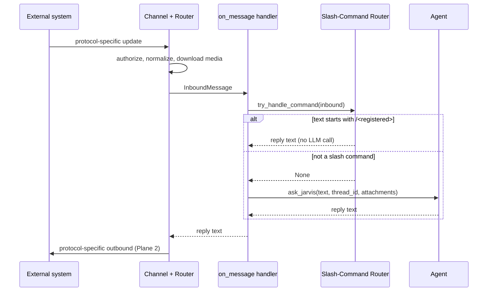
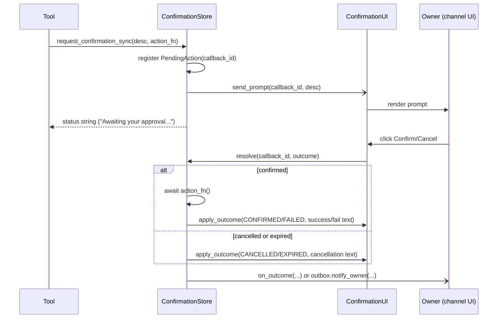

# Gateway Architecture

## Purpose

The gateway layer is the **boundary between Jarvis's domain logic and any external messaging system**. It exists to ensure that:

- Tools, the agent, and heartbeat code never know which channel a user is on.
- A new channel (email, WhatsApp, voice, custom app) is added by dropping a directory under `gateway/channels/<channel>/` — no edits to tools or agent code.
- Cross-cutting concerns (confirmations for destructive actions, owner addressing for proactive sends, message-shape normalization) have a single home.

The gateway is **not** responsible for:

- Agent reasoning or LLM invocation (that's `agent.py`).
- Memory persistence (that's `tools/core/memory.py` and the `MEMORY_DIR` sandbox).
- Scheduling (that's `heartbeat.py` + APScheduler).

A channel is a thin adapter. Anything richer than translating between an external protocol and the neutral contracts below belongs elsewhere.

---

## The Three Planes

Every interaction crosses the gateway through one of three planes. Each plane has a stable contract; channels implement them.

### Plane 1 — Inbound (external → agent)

A user sends something to Jarvis on any channel. The channel parses the protocol-specific update, normalizes it into an `InboundMessage`, and hands it to a single domain entry point — which first tries the channel-agnostic slash-command router; if the text isn't a registered slash command, it falls through to the agent.

```
┌──────────────┐    protocol-specific    ┌──────────────────┐    InboundMessage    ┌──────────────────────────┐
│ External     │ ──── update ──────────▶ │ Channel +        │ ────── (neutral) ──▶ │ on_message handler       │
│ system       │                         │ ChannelRouter    │                      │ (process_inbound_message)│
│ (Telegram,   │                         │                  │                      │                          │
│  email, ...) │                         │ - authorize      │                      │   ┌──────────────────┐   │
└──────────────┘                         │ - download media │                      │   │ try_handle_      │   │
                                         │ - batch albums   │                      │   │ command(inbound) │   │
                                         └──────────────────┘                      │   └────────┬─────────┘   │
                                                                                   │            │             │
                                                                                   │     hit ◀──┴──▶ miss     │
                                                                                   │      │           │       │
                                                                                   │      ▼           ▼       │
                                                                                   │  reply text   ask_jarvis │
                                                                                   └──────────────┬───────────┘
                                                                                                  │
                                                                                                  ▼
                                                                                            (Plane 2)
```


```mermaid
sequenceDiagram
    participant Ext as External system
    participant Ch as Channel + Router
    participant App as on_message handler
    participant Cmd as Slash-Command Router
    participant Agent

    Ext->>Ch: protocol-specific update
    Ch->>Ch: authorize, normalize, download media
    Ch->>App: InboundMessage
    App->>Cmd: try_handle_command(inbound)
    alt text starts with /<registered>
        Cmd-->>App: reply text (no LLM call)
    else not a slash command
        Cmd-->>App: None
        App->>Agent: ask_jarvis(text, thread_id, attachments)
        Agent-->>App: reply text
    end
    App-->>Ch: reply text
    Ch->>Ext: protocol-specific outbound (Plane 2)
```

### Plane 2 — Outbound (agent / heartbeat → external)

Two flavors of outbound:

1. **Reply to an inbound** — the channel router knows the originating `chat_id` and posts the reply back. This path uses `Channel.send(chat_id, text)` (or `send_media`) and stays inside the channel package.
2. **Proactive send** — heartbeat, reminder, confirmation-outcome, or webhook-triggered messages. The caller has no `chat_id`. This path goes through the **Outbox** (`gateway/outbox.py`), the single domain→channel seam for owner-addressed sends; the Outbox calls `Channel.send_to_owner(text)` / `send_to_owner_media(...)`.

```
agent reply ─────▶ Channel.send(chat_id, text) ─────▶ External system
(channel router)   Channel.send_media(...)
                   Channel.send_stream(...)            (default impl: collect, then send)

heartbeat /  ─────▶ default_outbox()          ─────▶ Channel.send_to_owner(text)       ─────▶ External system
reminders /         .notify_owner(text,               Channel.send_to_owner_media(...)
confirmation /       event=..., metadata=...)
webhook notifier          │
                          ├─ on success + event tagged: append notifications.jsonl (injected log sink)
                          └─ returns SendOutcome(ok, error) — never raises
```

The Outbox standardizes what the call sites used to hand-roll:

- **Log-on-success**: sends tagged with an `event` (closed constant set: `EVENT_HEARTBEAT`, `EVENT_REMINDER`, `EVENT_MEDIA`, `EVENT_LLM_MEDIA` — string values frozen; the agent's pending-mirror drain replays undrained rows into the owner thread) are recorded in `notifications.jsonl` only after delivery succeeded, via a host-injected log sink (the gateway imports nothing from the tools layer). Untagged sends (conversational confirmation outcomes) deliver without a log row — `notifications.jsonl` is "proactive pushes only".
- **Failure reporting**: a send never raises; the caller gets `SendOutcome(ok, error)` and decides what a failed delivery means for its own bookkeeping (heartbeat skips stamping `state.json`; a reminder stays in the events file and retries).
- **Thread→loop bridge**: module-level `bind_loop(loop)` / `submit(coro)` let sync worker threads (tool executors) safely schedule sends or UI work on the host loop — the confirmation store uses this for prompt scheduling.

`send_to_owner` remains the channel-level seam: no caller knows `ALLOWED_USER_ID`, `chat_id`, or any channel-specific addressing. The channel reads its own owner-config env (via the factory) at construction time and addresses internally.

### Plane 3 — Confirmation (destructive tool → user → action)

Destructive tools (`delete_memory`, `delete_sonarr_series_with_files`, etc.) cannot run silently. They must ask the owner first. The flow:

```
                                              ┌─────────────────────────────────────┐
                                              │ InMemoryConfirmationStore           │
┌─────────┐  request_confirmation_sync(...)   │  - generates callback_id            │
│ tool    │ ─────────────────────────────────▶│  - registers PendingAction          │
│ (sync   │                                   │  - schedules UI prompt on event loop│
│  worker │                                   │  - TTL background loop (60s)        │
│  thread)│ ◀───────────────── status string ─│                                     │
└─────────┘                                   └────────────────┬────────────────────┘
                                                               │
                                                               │ (delegates UI render)
                                                               ▼
                                              ┌──────────────────────────────────┐
                                              │ ConfirmationUI (per channel)     │
                                              │  e.g. TelegramConfirmationUI:    │
                                              │    InlineKeyboard, button click  │
                                              └────────────────┬─────────────────┘
                                                               │ user clicks Confirm/Cancel
                                                               ▼
                                              ┌──────────────────────────────────┐
                                              │ store.resolve(callback_id, ok)   │
                                              │  - runs action_fn() if ok        │
                                              │  - delivers outcome via the      │
                                              │    injected on_outcome callback, │
                                              │    or outbox.notify_owner(...)   │
                                              │    verbatim as fallback          │
                                              └──────────────────────────────────┘
```


```mermaid
sequenceDiagram
    participant Tool
    participant Store as ConfirmationStore
    participant UI as ConfirmationUI
    participant User as Owner (channel UI)

    Tool->>Store: request_confirmation_sync(desc, action_fn)
    Store->>Store: register PendingAction(callback_id)
    Store-)UI: send_prompt(callback_id, desc)
    UI->>User: render prompt
    Store-->>Tool: status string ("Awaiting your approval...")
    User->>UI: click Confirm/Cancel
    UI->>Store: resolve(callback_id, outcome)
    alt confirmed
        Store->>Store: await action_fn()
        Store->>UI: apply_outcome(CONFIRMED/FAILED, success/fail text)
    else cancelled or expired
        Store->>UI: apply_outcome(CANCELLED/EXPIRED, cancellation text)
    end
    Store-)User: on_outcome(...) or outbox.notify_owner(...)
```

The store is **channel-agnostic**. The UI plug-in is the only Telegram-specific (or email-specific, etc.) piece. The outcome is delivered through the host-injected `on_outcome` callback (which feeds it back through the agent for a conversational acknowledgement) or, if none is wired, posted verbatim via the Outbox — with **no** notification event either way: confirmation outcomes are conversation, recorded in `chat_history.jsonl`, never in `notifications.jsonl`.

---

## Slash-Command Dispatch

`gateway/commands/` is the **pre-LLM short-circuit** on Plane 1. Administrative actions — `/help`, `/clear`, `/status`, `/skills`, `/memory`, `/heartbeat`, `/logs` — must answer in one round-trip without burning a model call, and they must behave identically on every channel. The module sits between channel and agent precisely because it is the union of "below the agent" and "above any one channel."

### Module shape

```
gateway/commands/
├── router.py     # @command decorator + registry + try_handle_command(inbound) entry point
├── handlers.py   # built-in handlers — must import only `agent`, `tools`, neutral gateway code
├── format.py     # reply-layout helpers + check_reply (the contract below, executable)
└── __init__.py   # imports handlers so @command side-effects register before first dispatch
```

### Boundaries

| Layer | May the command module reach into it? | Why |
|---|---|---|
| `agent` (executor, sqlite conn, scope/thread state) | **Yes** | gateway↔agent boundary already exists |
| `tools/` (registry, memory tools, etc.) | **Yes** | same boundary — handlers like `/skills` read the registry, `/memory <file>` calls `read_memory` |
| `gateway/channels/<channel>/` | **No** | would invert the dependency; the channel imports the command list, never the reverse |
| Concrete protocol primitives (PTB `Bot`, SMTP, ...) | **No** | reply is returned as plain text; the channel handles framing |

### Contract

```python
Handler = Callable[[InboundMessage, list[str]], Awaitable[str]]

@command(name: str, description: str)        # registers a handler
def list_commands() -> list[Command]          # all registered, sorted; used by /help and channel command menus
async def try_handle_command(inbound) -> str | None
    # If inbound.user_text starts with /<registered>, dispatch and return reply text.
    # If it starts with / but the name isn't registered, return an "Unknown command" string.
    # Otherwise return None — caller proceeds with the agent.
```

`process_inbound_message` (`main.py`) calls `try_handle_command(inbound)` **first**. A non-`None` result short-circuits: it is logged to `chat_history.jsonl` just like an agent reply (so subsequent turns see the command/reply exchange) and sent via the channel's normal reply path.

### Reply formatting — one layout, two renderers

A handler returns **neutral markdown**; the channel it came from renders it. The channels disagree about a bare newline, and that disagreement is the single most repeated bug in this module:

| | renderer | bare `\n` between two plain lines |
|---|---|---|
| Telegram | `markdown_to_html.convert()` — line-based | preserved; renders as a line break |
| jarvis-app | CommonMark | **soft break — the lines flow into one paragraph** |

So a reply that looks correct in the Telegram client can silently collapse on the app. Any layout relying on a bare newline to separate lines is a latent app-channel bug.

**The contract** — the shape that satisfies both:

- A **bold header**, a **blank line**, then real `- ` list items. Telegram rewrites `^[-*+]\s` into `• `; CommonMark keeps genuine list items on their own lines.
- **Never a literal `•`** — Telegram's converter only rewrites the markdown marker, so a hand-typed bullet passes there and stays inert prose in the app.
- Emphasis is `**bold**`. A single `*` is *italic* in both, which is not what a header wants.
- Blocks are separated by a **blank line**, never a single newline.
- Two leading spaces nest a list item one level (clears the parent's content column for CommonMark; Telegram indents to match).

**Do not hand-roll it.** `gateway/commands/format.py` owns the layout:

```python
section("Available commands", items)      # **header**, blank line, "- item" per entry
kv_section("Jarvis status", pairs)        # same, rendered "- **key**: value"
document("HEARTBEAT.md", body)            # a header above raw file content
join(block_a, block_b)                    # blank-line-separated blocks
```

`check_reply(text)` in the same module is the executable half of the contract, and `scripts/ci/check_command_replies.py` runs it over every registered command's reply as its own CI job. Replies that are **verbatim file content** (`/memory <file>`, `/logs`, `/heartbeat <task>`) are exempt — the handler doesn't own that layout — and the guard reports them as skipped rather than silently passing them.

> Length is a separate concern: Telegram truncates the source markdown at 4096/1024 chars (`gateway/channels/telegram/channel.py`); the app channel has no equivalent cap. Handlers that return whole files (`/memory <file>`, `/logs`, `/heartbeat`) can exceed either. Tracked in #23 (paginate rather than truncate) — the app-side gap is unfixed there.

### Channel discoverability — optional but encouraged

A channel may expose the registered command set as native UX (Telegram autocomplete, an email help footer, an IVR menu, ...). The hook lives on the channel itself, not the gateway, because the rendering shape is protocol-specific:

```python
# gateway/channels/telegram/channel.py
async def register_command_menu(self) -> None:
    cmds = [BotCommand(c.name[:32], c.description[:256]) for c in _list_slash_commands()]
    await self._require_bot().set_my_commands(cmds)
```

`main.py` calls this once after `attach()`. Channels without a discoverability surface (raw IMAP email, e.g.) simply skip it; `/help` always works as the universal fallback.

### What does *not* belong here

- **Agent-level intents** ("send a message," "summarize my day") — those are the LLM's job. Slash commands are for things that *bypass* reasoning.
- **Per-channel commands** — if a command only makes sense for one channel, it isn't a slash command; it's a channel-internal handler that doesn't go in this module.
- **Long-running work** — handlers should answer in one round-trip. If the work is slow, return an acknowledgement immediately and use a tool with the confirmation/notification plane.

---

## App Surfaces

`gateway/apps/` is the **structured, request/response** surface on Plane 1 — the agent declares things it can answer directly, and a channel with somewhere to show them (the jarvis-app hub's Apps screen) publishes the list in its own wire shape. Deliberately parallel to `gateway/commands/`: same "below the agent, above any one channel" position, same rule that declaring is agent-level while publishing is channel-level. The difference is the shape of the answer — a slash command returns markdown for a human to read, an app entry returns **structured data for a client to render**.

There is **no model in this path.** Dispatch is deterministic.

### Module shape

```
gateway/apps/
├── registry.py   # mechanism — AppSpec/AppEntry, register_app, list_apps, dispatch, AppError codes
├── specs.py      # content — one import line per app; the single file that says which exist
├── memory.py     # the "memory" app — read-only list/read over MEMORY_DIR
└── __init__.py   # re-exports the registry and imports specs so registration precedes first use
```

### Contract

```python
Handler = Callable[[dict[str, str]], Awaitable[Any]]

AppEntry(id: str, method: str, params: tuple[str, ...], handler: Handler)
AppSpec(ns: str, name: str, entries: tuple[AppEntry, ...])

def register_app(spec) -> AppSpec         # validates at import; returns the spec
def list_apps() -> list[AppSpec]           # sorted by ns; what a channel publishes
async def dispatch(ns, entry_id, params) -> Any
```

`ns`, entry `id` and param names are identifiers (`^[a-z][a-z0-9_]{0,31}$`), `name` is 1–64 chars of free text. All of it is checked **at registration — i.e. at import**, and an app with no entries, or an entry with no handler, is refused. That is deliberate: publishing a manifest is best-effort (a channel logs a rejected declare and carries on), so an unvalidated typo would surface only as an Apps screen that is mysteriously empty. Failing loudly at startup is the whole point of validating a second time.

`method` is `GET` or `POST`. HTTP verbs are used on purpose despite this module naming no transport: they are the precise vocabulary for "safe and idempotent" versus "mutating," and they let a channel refuse a write to a read-only entry without a round-trip. A channel speaking something else maps out of these verbs.

`params` is the **closed set** of names an entry accepts. `dispatch` re-checks it even when the channel already filtered — this is the layer that knows what was declared, and it has to hold for a channel that filters nothing.

### Error vocabulary — closed on purpose

| Exception | `code` | Means |
|---|---|---|
| `AppNotFound` | `not_found` | No such app, entry, or addressed thing |
| `AppInvalidRequest` | `invalid_request` | Undeclared param, missing required one, or a value the entry can't act on |

A channel maps these to its own status codes, so an unrecognised value would hand this side control of the transport's status vocabulary. Raise one of the two. Anything **else** a handler raises propagates as-is and is the caller's to report as an internal fault — never blamed on the request.

### The queue-split rule

**An app query must never share the turn queue.** A channel's turn consumer is serialised so two messages can't run overlapping LLM turns on one thread. That reason does not reach a query: it names no thread and needs no model, while a client is parked on it with a timeout shorter than a turn can take. Sharing the queue wouldn't make queries slow — it would fail them outright whenever a conversation happened to be in flight, and it would read as a flaky hub rather than a queueing bug. Queries therefore split off at **fetch** time, onto their own queue and drain task (`gateway/channels/jarvis_app/router.py`).

For the same reason, every blocking call inside a handler goes through `asyncio.to_thread`. One event loop serves the poll, the in-flight turn, and the query drain; a synchronous filesystem read re-couples exactly what the queue split decoupled.

### The security line

Param values arrive **uninterpreted** — a relay bounds their length and nothing else, because judging a path would mean knowing what the app means by one. So `../../secrets/.env` reaches a handler verbatim, and resolution inside the handler is the only defence there is.

`gateway/apps/memory.py` therefore **imports** `_get_safe_path` from `tools/core/memory.py` rather than reimplementing it — a second copy of a security boundary is one that can drift, and the copy is always the one with less scrutiny. It adds one guard on top: `_get_safe_path` resolves with `abspath`, which does not follow symlinks, so a link inside the tree pointing out of it passes. That is tolerable for a local tool the agent drives; this surface is reachable from a device, so it also requires the **real** path to stay contained (#73). An extra guard, never a replacement.

The memory app also walks `MEMORY_DIR` directly instead of calling the memory *tools*: their output is English written for a model, and parsing it here would ship a client that reads prose and breaks when a docstring is reworded.

### Channel publication — optional, same as command menus

A channel publishes the manifest only if it has an Apps surface; one that doesn't simply never calls `list_apps()` and needs no stub. The jarvis-app channel maps `AppSpec`/`AppEntry` into the hub's wire shape at the boundary, so the registry stays channel-agnostic, and declares **at startup and on every reconnect** — the hub holds its registry in memory, so a hub restart forgets it, and the degraded→reachable transition is the only place that knows a link was re-made. A declare replaces the whole list, so re-sending is idempotent. A failed declare is logged, never fatal.

> **Nothing is served until the process restarts.** The agent imports these modules once at boot. A surface that is written, committed, and correct still answers nothing until the service is bounced, and the failure is silent from the client's side: the update is fetched, the offset advances, and an unknown update type is dropped on an early return. A query that times out with no agent-side log at all is this, not a handler bug — check process start time against source mtimes first.

### What does *not* belong here

- **Anything needing the model.** If answering requires reasoning, it's a tool or a turn, not an app entry.
- **Long-running work.** A client is parked on the answer with a short timeout.
- **Channel-specific shapes.** The registry names no transport, no URL, and no channel; `id` is an identifier the agent routes on, never a URL path.

---

## Interactive Blocks

A block is structured content a message can carry beyond text — today a **form**
(labelled, prefilled boxes the owner corrects and submits in one tap); the hub's
contract also defines `buttons` and `card`, unbuilt here. The layer lives in
`gateway/blocks/` and is deliberately **kind-generic**: adding a kind touches the
neutral model and one channel adapter's table, never the `Channel` ABC, the
Outbox, or another channel.

### Module shape

```
gateway/blocks/
├── base.py    # Block (kind, summary) · Interactive(Block) adds callback_id
│              #   · BlockAction — one neutral inbound tap
└── form.py    # Form / FormRow / TextField / NumberField + validation
               #   + render_submission() (submitted values -> turn text)
```

Blocks are frozen dataclasses describing *intent*, never wire shape. All
validation runs at construction, so a bad form fails at its caller with a
correctable message rather than as a hub 422 inside an async send: row cap (6),
units on every field of a multi-field row, type/default agreement (bools
refused), unique snake_case field ids, non-empty title and summary.
`callback_id` is always generated (caller slug + entropy, `push-day-a3f1`) —
uniqueness is never the caller's job. `Form` has **no `values` field**: that
records what the owner submitted, stamped by the hub on the tap, so a
pre-stamped form is unconstructible rather than merely forbidden.

### A form is content, not a protocol

Unlike a confirmation — whose store holds a live `action_fn` genuinely pending
approval — a form defers nothing. Nothing is pending while it sits untapped, so
there is **no pending store, no TTL, no sweep**, and a restart forgets nothing
that matters. The LangGraph thread is the only store: the sending tool's return
string records what was asked (field ids + prefills), and the submit lands in a
context that contains the question.

### Outbound

```
caller ──▶ channel.supports_block(kind)?      # pre-flight — decides "this
   │            no ──▶ caller's own fallback  #   channel has no forms"
   ▼ yes
origin_outbox().send_block_to_owner(text, block) ──▶ Channel.send_block(text, block)
   │                                                   (one POST: text + block,
   └─ returns SendOutcome — never raises                all-or-nothing)
```

The seam never invents a fallback: on a channel that can't render the kind,
nothing is sent and the caller decides — the model says it conversationally
(the `send_form` tool returns the prepared prefills as a directive), a code
caller sends its own `notify_owner(...)`. Nothing goes out partially, so the
owner never gets a dangling opener pointing at a card that isn't there. Wire
mapping is an adapter-side table keyed by block type (`_BLOCK_WIRE` in the
jarvis-app channel) — deliberately not a `to_wire()` on the neutral model,
which would bake one hub's JSON into it.

### Inbound

The channel router translates a tap into a neutral `BlockAction(kind,
action_id, message_id, callback_id, values)` and dispatches by kind:
`confirmation` resolves below the LLM via the store (Plane 3); `form` becomes
an ordinary inbound turn — `render_submission()` turns the values into text
(`[Submitted form push-day-a3f1] bench_reps: 8 · core: (left empty)`; `null`
stays visibly distinct from zero, the one distinction the hub preserves), which
is persisted to `chat_history.jsonl` by the shared handler before the model
runs. No deterministic handler touches a database on submit — what to do with
the values is the model's decision in thread context.

**A form's card is closed by `PATCH {state: "logged"}` strictly *after* the
turn completes.** A turn that dies leaves the card live — and that is the
recovery path: the hub's re-tap guard lifts once the update is acked (which
happens at fetch), so the owner re-taps and the turn re-runs with thread
context. A failed PATCH after a successful turn is logged and never fails the
consumed update. The form vocabulary is `logged | expired` (no `cancelled` — a
form has nothing to decline); expiry is nobody's job today, since with no
pending store a stale card costs nothing.

---

## Contracts

### `InboundMessage` (`gateway/base.py`)

```python
@dataclass
class InboundMessage:
    user_id: int            # external system's user identifier (raw)
    chat_id: int            # external system's chat/conversation identifier
    thread_id: str          # agent thread ID — OWNER_THREAD_ID for all owner traffic (see thread_id namespacing)
    user_text: str          # the user's text content (or a placeholder like "[IMAGE attachment]")
    channel: str            # Channel.name of the producer — the turn's origin marker for routing
    attachments: list[dict] # media: kind, path (ABSOLUTE, channel-produced), mime_type, source
```

`thread_id` namespaces per-conversation state; `channel` carries the turn's origin (the thread id names no channel).

### `Channel` ABC (`gateway/base.py`)

```python
class Channel(ABC):
    name: str                          # "telegram", "email", "whatsapp", ...
    supports_streaming: bool = False   # True iff send_stream is meaningful (e.g. voice + TTS)

    @abstractmethod
    async def send(self, chat_id: str, text: str, *, reply_to: str | None = None) -> None: ...

    @abstractmethod
    async def send_media(self, chat_id: str, kind: str, payload: bytes, caption: str | None = None) -> None: ...

    @abstractmethod
    async def send_to_owner(self, text: str) -> None: ...
    @abstractmethod
    async def send_to_owner_media(self, kind: str, payload: bytes, caption: str | None = None) -> None: ...

    @abstractmethod
    def authorize(self, raw_user_id: str) -> bool: ...

    @property
    @abstractmethod
    def owner_thread_id(self) -> str: ...

    async def send_stream(self, chat_id: str, chunks: AsyncIterator[str]) -> None:
        """Default: collect chunks, then send once. Streaming channels override."""
        full = "".join([c async for c in chunks])
        await self.send(chat_id, full)

    # Interactive blocks (gateway/blocks/) — optional, kind-generic:
    def supports_block(self, kind: str) -> bool:          # default False
    async def send_block(self, text: str, block) -> None: # default raises NotImplementedError
```

| Method | Purpose | Notes |
|---|---|---|
| `send` / `send_media` | Reply to a known chat. | Used by the channel's own router (Plane 1 → Plane 2). |
| `send_to_owner` / `send_to_owner_media` | Proactive message to the channel's owner. | Called only by the Outbox. Channel reads its own owner-config env at construction. |
| `authorize` | Is this user allowed to use Jarvis on this channel? | Single allowlist per channel today; can grow later. |
| `owner_thread_id` | Agent thread id of the owner's conversation. | Same value the channel's router stamps on inbound messages; lets domain code address the owner's thread without knowing the format. |
| `send_stream` | Streaming send (TTS, partial reply). | Default collect-then-send; voice channels override. |
| `supports_block` | Can this channel render block `kind`? | The pre-flight callers consult before composing; default `False`, channels opt in. |
| `send_block` | Owner-addressed text + interactive block, all-or-nothing. | Called via `Outbox.send_block_to_owner`. Default raises; a new kind never edits the ABC. |

Lifecycle is deliberately **not** on the ABC: bring-up/tear-down is owned by the channel *package* (Telegram: `gateway/channels/telegram/host.py` wraps the PTB Application; the factory returns a stack with `start()`/`stop()`). A former abstract `start(on_message)` was removed once the host pattern left it with no caller.

### `Outbox` (`gateway/outbox.py`)

```python
EVENT_HEARTBEAT = "heartbeat"; EVENT_REMINDER = "reminder"
EVENT_MEDIA = "notification"; EVENT_LLM_MEDIA = "llm_notification"   # values frozen

@dataclass
class SendOutcome:
    ok: bool
    error: str | None = None

def bind_loop(loop) -> None                       # host binds once at startup (inside host.start())
def submit(coro) -> concurrent.futures.Future     # thread-safe scheduling onto the host loop

class Outbox:
    def __init__(self, channel: Channel, log_sink: LogSink | None): ...
    async def notify_owner(text, *, event=None, metadata=None) -> SendOutcome
    async def notify_owner_media(kind, payload, caption=None, *, event=None, metadata=None) -> SendOutcome
    async def send_block_to_owner(text, block, *, event=None, metadata=None) -> SendOutcome
```

The single seam for owner-addressed sends (see Plane 2). `default_outbox()` in `gateway/factory.py` is how domain code reaches it; `LogSink` is injected by the host (`async_append_notification_log`) so the gateway stays free of tools-layer imports.

### `Confirmation` ABC (`gateway/confirmation/base.py`)

```python
class Confirmation(ABC):
    @abstractmethod
    def request_confirmation_sync(
        self,
        description: str,
        action_fn: Callable[[], Awaitable[str]],
        result_ok_text: str = "Action completed.",
        result_cancel_text: str = "Action cancelled.",
    ) -> str:
        """Called from a sync tool worker thread. Returns immediately with a status string."""
```

The store implementation (`InMemoryConfirmationStore`) handles bookkeeping, TTL eviction, and outcome dispatch; channels implement only the UI half:

### `ConfirmationUI` ABC (`gateway/confirmation/base.py`)

```python
class ConfirmationOutcome(str, Enum):
    CONFIRMED = "confirmed"
    CANCELLED = "cancelled"
    FAILED = "failed"           # confirmed, but the action itself raised
    EXPIRED = "expired"
    ALREADY_HANDLED = "already_handled"

class ConfirmationUI(ABC):
    @abstractmethod
    async def send_prompt(self, callback_id: str, description: str) -> None: ...

    @abstractmethod
    async def apply_outcome(
        self, callback_id: str, outcome: ConfirmationOutcome, outcome_text: str
    ) -> None:
        """Deliver the final state. `outcome` is the structured result (fixed
        vocabulary); `outcome_text` is the human-readable prose. Implementations
        read whichever fits their wire — most read exactly one. Must not raise;
        the store isolates each call so a failure here can't skip what follows."""

    # Channels may also expose a channel-native callback handler
    # (e.g. PTB CallbackQueryHandler) that calls store.resolve(callback_id, outcome).
```

`InMemoryConfirmationStore.__init__(ui: ConfirmationUI, outbox: Outbox, owner_thread_id: str, on_outcome=None)` — one store **per channel**, carrying that channel's `owner_thread_id` and `outbox` so a resolved confirmation acks on the channel the turn came from. The store delegates rendering to `ui` and delivers the final outcome via the injected `on_outcome(system_text, owner_thread_id, outbox)` domain callback (conversational acknowledgement) or `outbox.notify_owner(...)` verbatim as fallback. Stores register per channel name; `get_confirmation()` resolves the **origin** channel's store from the running turn's `CURRENT_THREAD_ID` (falling back to the default channel for origin-less turns).

`apply_outcome` is one method carrying both a structured `outcome` and rendered `outcome_text`, rather than two parallel methods. `TelegramConfirmationUI` reads only `outcome_text` (it edits the prompt message to that string) — the jarvis-app hub has no such free-text edit at all, only `PATCH {state}` on the block, so `AppConfirmationUI` reads only `outcome`, mapping it to the hub's `confirmed|cancelled|expired` vocabulary. An earlier draft split this into two independently-overridable methods (one abstract but often vestigial, one optional but load-bearing for the second channel) — collapsed into one abstract method after review, since both facts describe the same event and a channel is expected to just ignore whichever field it doesn't need. `InMemoryConfirmationStore._apply_outcome` wraps every call in a try/except so a channel's delivery failure can never skip the conversational follow-up after it.

---

## Media Handling

Media (images, video, voice) cross the gateway in both directions. The contracts above (`send_media`, `send_to_owner_media`, `InboundMessage.attachments`) cover the wire-shape; this section explains the flow and storage model.

### Inbound — download, cache, attach

```
External media update                                  gateway/channels/<channel>/media_cache/   (channel-owned)
        │                                                  └── audio_<file_id>.ogg
        ▼                                                  └── image_<file_id>.jpg
Channel router (per-channel)                               └── video_<file_id>.mp4
  ├── channel.download_media(remote_id) ─────────────────▶ bytes
  ├── <channel>.media_cache.save(bytes, kind, id) ───────▶ ABSOLUTE path (channel-owned cache)
  └── InboundMessage.attachments.append({
        kind:       "image" | "video" | "audio" | "document",
        path:       ABSOLUTE filesystem path, channel-produced (open as-is),
        mime_type:  RFC 6838 type from the source,
        source:     channel name (e.g. "telegram"),
      })
```

**The neutral kind is the channel's translation, not the source's tag.** A source
whose own vocabulary is coarser (the jarvis-app hub tags everything that isn't an
image or audio as `file`) resolves it against the mime type at the boundary, the
same way Telegram's router tags `kind="video"`. A kind outside the neutral set —
notably `file` — means **unidentified**: the agent surfaces it to the model as
text and never feeds the bytes.

**The channel owns media end to end.** Each channel ships its own
`gateway/channels/<channel>/media_cache.py` (`save(bytes, kind, id) -> absolute path`,
`trim(retention_days)`) and its own cache dir (gitignored). The downstream
handler (`process_inbound_message`) threads `attachments` into the agent's
multimodal input; the agent **opens `path` directly** and loads the bytes once
per turn. The agent receives **paths, not bytes**, so the same media is
re-referenced in later turns without re-downloading — and the path is
**absolute and channel-produced**, so `tools/*` and `agent.py` contain no
media path, no `MEDIA_DIR`, no resolver, and no channel name. A new channel
adds only its own `media_cache.py`; nothing in core/agent changes.

### Outbound — replies and proactive sends

Two outbound methods on the `Channel` ABC:

- `send_media(chat_id, kind, payload: bytes, caption)` — reply-context. The channel uploads the bytes; the caller does not know how. Used when the agent wants to attach an image to a reply (no caller today, but the contract reserves the slot).
- `send_to_owner_media(kind, payload: bytes, caption)` — proactive, reached via `outbox.notify_owner_media(...)`. Used by the media notifier (Sonarr/Radarr poster images) and any other proactive channel-pushed media.

**Bytes, not paths, for outbound.** The caller (e.g. the notifier) typically fetches the media from a third party (Jellyfin/Radarr) and hands the channel the raw bytes. The channel decides how to upload (Telegram: `send_photo` with multipart upload; future email: MIME attachment). Channels that can't represent a given `kind` (e.g. early email may not support video) raise `NotImplementedError`; the caller is responsible for downgrading or skipping.

### Storage — channel-owned cache

Each channel owns its media cache module **and** directory. **Filenames encode the source-system's identifier** (Telegram embeds `file_id`), making the blobs strictly channel artifacts.

| Channel | Cache module | Cache directory |
|---|---|---|
| Telegram | `gateway/channels/telegram/media_cache.py` (`save`/`trim`) | `gateway/channels/telegram/media_cache/` |
| jarvis-app | `gateway/channels/jarvis_app/media_cache.py` (`save`/`trim`) | `gateway/channels/jarvis_app/media_cache/` |
| Email (future) | `gateway/email/media_cache.py` | `gateway/email/media_cache/` |

`save(bytes, kind, file_id) -> absolute path`; the router imports and calls its own channel's `media_cache.save` directly (no injection). Retention: `trim()` deletes blobs older than 90 days (mtime) and runs once at module import (process start) — channel-owned, no cross-layer call. Cache dirs are gitignored (`gateway/channels/*/media_cache/`).

### Layering invariant

Media is owned by the channel end to end. `tools/*` and `agent.py` contain **no** media path, no `MEDIA_DIR`, no resolver, and no channel name; the agent opens the absolute `attachments[].path` it is handed. `main.py` does not import or broker media. Adding a channel = adding its own `gateway/channels/<channel>/media_cache.py`; nothing in core/agent/main changes.

---

## Owner Addressing

Proactive sends (heartbeat reminders, confirmation outcome notifications, scheduled events) come from code that has no `chat_id`. Two design choices:

1. **Reach into the channel's allowlist** — fragile and Telegram-shaped (`ALLOWED_USER_ID` happens to equal `chat_id` for private chats; not true elsewhere).
2. **Push the concept inside the channel** — `Channel.send_to_owner(text)` reads the channel's own owner-config and addresses internally.

Jarvis takes option (2). Each channel's factory reads its owner-config env and passes it into the channel constructor:

| Channel | Owner-config env | What it stores |
|---|---|---|
| Telegram | `ALLOWED_USER_ID` | Telegram user ID (== private chat_id) |
| Email (future) | `ALLOWED_EMAIL` | RFC 5321 address |
| WhatsApp (future) | `ALLOWED_PHONE` | E.164 phone |
| Voice (future) | `ALLOWED_PHONE` | (shared with WhatsApp or its own) |

The factory reads the env value and passes it into the channel constructor; nowhere else in the codebase reads it (`main.py` only calls `load_dotenv` — it never sees channel config).

Domain code reaches channels through factory accessors, never through a channel object. **Proactive** sends use `default_outbox()`, which resolves the configured default channel (`JARVIS_DEFAULT_CHANNEL`, default `telegram`) at call time through a name-keyed registry; `default_owner_thread_id()` addresses the owner's thread on that default channel, for origin-less owner-addressed routing. **Reactive** traffic follows its origin channel instead: a resolved confirmation acks on the thread it came from (the store carries its own channel's thread/outbox), and `get_confirmation()` resolves the origin channel's store from the running turn's `CURRENT_CHANNEL` (router-stamped; the thread id names no channel). `origin_channel()` / `origin_outbox()` apply the same origin rule to what a turn *produces* — a tool-initiated send (e.g. `send_form`) consults the origin channel's capability and sends on its outbox, falling back to the default entry for origin-less turns. The failure modes differ on purpose: `get_confirmation()` **raises** when the resolved channel has no store (a destructive tool with nowhere to confirm is a wiring bug), while `origin_*` **falls back** to the default (an origin-less turn is a normal case). "Which channel does this target" is a routing decision that lives in `factory.py`, not in callers.

---

## `thread_id` Namespacing

Two threads exist. `thread_id` is the LangGraph checkpointer key and the `chat_history.jsonl`
tag — and nothing else: it does **not** name a channel.

| Thread | Holds |
|---|---|
| `owner` (`gateway/base.py` OWNER_THREAD_ID) | The one owner conversation — every channel stamps it, so a topic continues across surfaces |
| `heartbeat` (singleton) | Background ticks |

A channel is a surface onto the conversation, not a conversation of its own. The turn's origin
channel travels separately (`InboundMessage.channel` → `CURRENT_CHANNEL`), which is what
confirmation/block routing reads. Historic per-channel ids (`telegram_<user_id>`,
`jarvis-app_<owner>`) survive only as tags on old `chat_history.jsonl` rows and orphaned
checkpoints.

---

## Adding a New Channel — Checklist

Concrete steps to add an `email` (or `whatsapp`, etc.) channel after Phase 1 lands:

1. **Pick the directory.** `gateway/channels/email/`. Mirror Telegram's split:
   - `channel.py` — `EmailChannel(Channel)`.
   - `router.py` — IMAP IDLE / poller / webhook handler that produces `InboundMessage`.
   - `host.py` — owns the protocol client's lifecycle (connect, begin IDLE / register webhook on `start()`, disconnect on `stop()`). Mirrors `TelegramHost`.
   - `confirmation.py` — `EmailConfirmationUI(ConfirmationUI)` (e.g. magic-link confirm/cancel URLs).
2. **Implement the `Channel` ABC** in `channel.py`. Constructor takes `allowed_email: str` (or whatever owner-config makes sense). Implement `send` (SMTP), `send_media` (SMTP attachment), `send_to_owner` (fixed recipient), `authorize` (compare sender), `owner_thread_id` (e.g. `email_<sanitized_address>` — single-source the format in `channel.py` and reuse it from the router).
3. **Define an owner-config env** (e.g. `ALLOWED_EMAIL`) and add it to `/app/secrets/.env`. Add channel-specific config (`SMTP_HOST`, `SMTP_USER`, `IMAP_HOST`, etc.). The **factory** reads all of it — `main.py` never sees channel config.
4. **Implement `ConfirmationUI`** if your channel needs a confirmation flow. The store interface is fixed — `send_prompt` and `apply_outcome` are the two required, channel-specific methods. `apply_outcome` carries both a structured `outcome` and rendered `outcome_text`; read whichever fits your wire and ignore the other (see `TelegramConfirmationUI` for text-only, `AppConfirmationUI` for structured-state-only).
5. **Register in `gateway/factory.py`** — add a `build_email_stack(...)` factory that reads the config env, constructs channel + outbox + router + confirmation store/UI + host, wires the router to `process_inbound_message`, registers the defaults (outbox, confirmation, default channel), and returns a stack with `start()`/`stop()`.
6. **Wire startup in `main.py`** — call the factory and `await stack.start()`. That's the whole host-side footprint.
7. **Update `thread_id` convention** — use `email_<sanitized_address>` (or whatever format suits the channel's identifier domain).
8. **(Optional) Surface slash commands.** Slash commands already work on the new channel for free — `process_inbound_message` calls `try_handle_command` before the agent regardless of which channel produced the `InboundMessage`. If your channel has a native command-menu / autocomplete / help-footer surface, add a method on the channel (mirroring Telegram's `register_command_menu()`) that calls `gateway.commands.list_commands()` and renders the list in protocol-native form; have `main.py` invoke it once at startup. No protocol → skip; `/help` is the universal fallback.
9. **(Optional) Surface app queries.** Same shape as step 8, and same "skip it if there's nowhere to show it" rule. If your channel has a structured-surface affordance, publish `gateway.apps.list_apps()` in your protocol's wire shape (declare at startup **and** on reconnect if the far side holds the registry in memory), and route inbound queries to `gateway.apps.dispatch(ns, entry_id, params)` — on their **own queue**, never the turn queue (see App Surfaces § the queue-split rule). Map `AppNotFound`/`AppInvalidRequest` to your transport's statuses; report anything else as an internal fault. A channel with no such surface skips this entirely and needs no stub.
10. **Test** following the verification protocol in [docs/plans/ARCHITECTURE_PLAN.md](../plans/archive/ARCHITECTURE_PLAN.md). At minimum: inbound text → reply, proactive send via heartbeat, destructive-tool confirmation flow, a slash command (e.g. `/help`).

What you should **not** need to touch when adding a channel:
- Any file under `tools/` or `agent.py`.
- `heartbeat.py`.
- `gateway/commands/` — slash commands are inherited; handlers stay channel-agnostic.
- `gateway/apps/` — app surfaces are declared once, agent-side; only *publishing* them is channel work, and only if your channel has somewhere to show them.
- The `Confirmation` or `Channel` ABCs (if you do, the abstraction has leaked — push back).

---

## See Also

- [RUNTIME.md](RUNTIME.md) — the agent runtime & tool registry that sits behind this gateway's `on_message` handler.
- [MEMORY.md](MEMORY.md) — the memory & identity layer; the channel-owned media cache contract referenced here is detailed there.
