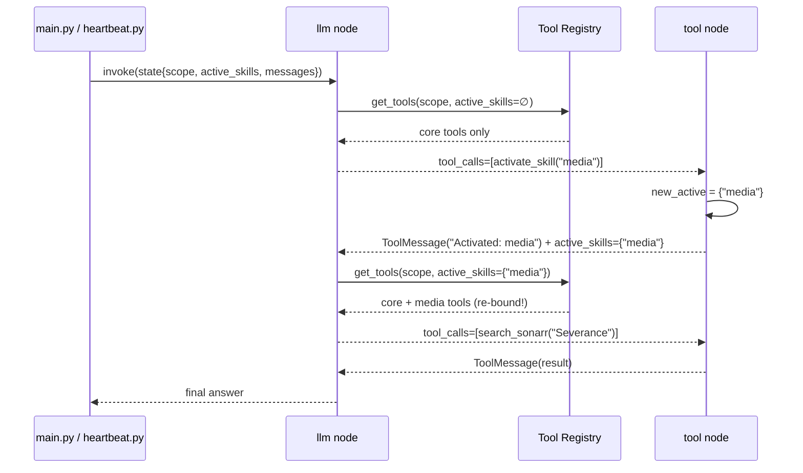

# Agent Runtime & Tool Registry Architecture

## Purpose

The runtime layer is the **boundary between a user/heartbeat turn and the LLM tool loop**. It exists to ensure that:

- The LLM's tool surface in any given turn is **small and topical**. A cooking conversation does not carry Sonarr/Radarr/Arbox tool schemas in the prompt.
- When the LLM realizes it needs a capability, it activates the relevant skill and uses it **in the same turn** — no "ask again next message" awkwardness.
- The system prompt and tool advertisements are **assembled per turn from a registry and files**, not hardcoded and hand-synced against tool docstrings.
- `user` and `heartbeat` turns share one graph, one checkpointer, and one tool registry, differing only by **scope** (which prompt is built, which skills start active) — never by a forked code path.

The runtime is **not** responsible for:

- Channel translation, owner addressing, or confirmation UI (that's the gateway — [GATEWAY.md](GATEWAY.md)).
- Memory persistence or the path sandbox (that's `tools/core/memory.py` and the `MEMORY_DIR` sandbox).
- Scheduling cadence (that's `heartbeat.py` + APScheduler — it *calls* this layer once per tick).

The runtime is the LangGraph loop plus the tool registry that feeds it. Anything richer than "decide the prompt + tool set for this turn, run the loop, persist state" belongs elsewhere.

---

## Why This Replaces `create_agent`

LangGraph's prebuilt `create_agent(model, tools=[...])` binds tools **once at construction** and loops `LLM → ToolNode → LLM → … → END` with that fixed set. Same-turn skill activation requires the LLM call to **re-bind tools mid-loop**, which the prebuilt graph cannot do.

`StateGraph` (the lower-level API `create_agent` is itself built on) lets us own the LLM node and re-bind per invocation. That is the entire reason for the migration. Alternatives (dispatch meta-tool, PydanticAI, raw SDK loop) were evaluated and rejected — see [ARCHITECTURE_PLAN.md](../plans/archive/ARCHITECTURE_PLAN.md) "Runtime Alternatives Considered". Everything that already works (the `PruningSqliteSaver` checkpointer, the `_add_and_trim` reducer, `_strip_media_blobs`, `JarvisState`) carries over unchanged.

---

## The Two-Tier Tool Model

Mirrors OpenClaw's "built-ins always available + skills allowlisted on demand" pattern.

### Tier 1 — Core tools (always bound)

A small set (~9 tools) used in nearly every conversation. Full JSON schemas are always in the prompt; the cost is fixed and cheap.

| Module (`tools/core/`) | Tools | Notes |
|---|---|---|
| `memory.py` | `read_memory`, `write_memory`, `list_memory`, `delete_memory` | `delete_memory` is `destructive` → confirmation. |
| `search.py` | `web_search` | |
| `history.py` | `get_chat_history`, `get_notification_history` | Read-only recall. See "The notification question" below. |
| `scheduling.py` | `manage_reminder` | create / list / delete reminders. |
| `activate_skill.py` | `activate_skill`, `deactivate_skill` | The meta-tools that expose Tier 2. |

### Tier 2 — Skills (advertised compactly, activated on demand)

Tools grouped by **namespace**. A namespace is a skill — and a namespace may be **hierarchical** (`parent/child`), which makes it a *sub-skill*. Their full schemas are **not** in the prompt until activated — only a one-line advertisement per skill.

| Namespace | Module dir | Tools |
|---|---|---|
| `media` | `tools/media/` | **Parent / discovery index — owns no tools of its own.** A valid `activate_skill` target; activating it expands the five sub-skills below in the prompt. |
| `media/radarr` | `tools/media/radarr/` | Movies: `search_radarr`, `get_radarr_queue`, `get_radarr_wanted`, `get_radarr_library`, `add_radarr_movie`, `set_radarr_monitored`, `set_radarr_quality_profile`, `trigger_radarr_search`, `delete_radarr_movie`, `delete_radarr_movie_with_files` ⚠, `remove_from_radarr_queue`. |
| `media/sonarr` | `tools/media/sonarr/` | TV: `search_sonarr`, `get_sonarr_queue`, `get_sonarr_wanted`, `get_sonarr_library`, `add_sonarr_series`, `set_sonarr_monitored`, `set_sonarr_quality_profile`, `trigger_sonarr_search`, `delete_sonarr_series`, `delete_sonarr_series_with_files` ⚠, `remove_from_sonarr_queue`. |
| `media/prowlarr` | `tools/media/prowlarr/` | Indexer search: `search_prowlarr`. |
| `media/jellyseerr` | `tools/media/jellyseerr/` | Requests: `search_jellyseerr`, `get_jellyseerr_requests`, `request_media`. |
| `media/system` | `tools/media/system/` | Stack health / overview: `get_library_overview`, `get_media_system_health`. |
| `fitness` | `tools/fitness/` | Arbox + training: `manage_fitness_plan`, `fetch_upcoming_arbox_classes`, `fetch_weekly_gym_schedule`, `sync_arbox_attendance`, `log_exercise_stats`, `log_running_session`, `log_wod_result`, `query_exercise_history`, `get_today_workout_id`, `get_weekly_fitness_summary`, `get_adherence_report`, `query_fitness_db` (read-only ad-hoc SQL). |

⚠ = `destructive`. **No `home` placeholder** — namespaces are added when their tools exist, not before. The registry is extensible: a new top-level skill is a new directory plus `namespace="<name>"` on its tools; a new sub-skill is a `tools/<parent>/<child>/` subpackage plus `namespace="<parent>/<child>"`. Nothing else.

#### Sub-skills / nested namespaces

A `parent/child` namespace is a **sub-skill**. The mechanism is the same compact-advertisement + dynamic-activation primitive applied one level deeper:

- **Two-step discovery.** `compact_skill_list` is hierarchy-aware: only top-level skills are listed by default. A parent's sub-skills are listed (indented, under the parent) **only when the parent is in `active_skills`** — children stay hidden until the parent is activated.
- **Parent may own zero tools.** `media` registers no tools; it is purely a discovery index. `_visible` is unchanged — a parent with no tools binds nothing; a sub-skill's tools bind iff its own `parent/child` namespace is active.
- **Child activation is independent — no cascade.** Activating `media/radarr` binds only radarr tools. Activating or deactivating the parent `media` does **not** activate or deactivate any child; the parent listing is a discovery aid, not a bundle. A sub-skill's rules body (if any) renders whenever the sub-skill itself is active, even if the parent is not — guardrails stay attached to the bound tools.
- **`skill_namespaces()`** returns every registered non-core namespace **plus every derived parent**, so both `media` and `media/radarr` are valid `activate_skill` targets (validated through the existing `_split_known`). `agent.py`, `JarvisState`, and the tool node need no changes — the "activate the skill first" `ToolMessage` already names the full `parent/child` namespace.

This is the first intentional extension *beyond* OpenClaw's flat skill model (OpenClaw skills have no parent/child nesting); it reuses Jarvis's existing dynamic-activation primitives and does not touch the capability/sandbox boundary.

### The notification question (why there is no `notifications` skill)

"Notifications" looks like a candidate namespace but is deliberately **not** one, because the concern is split across two layers that already have homes:

1. **Querying past notifications** — `get_notification_history` is read-only recall, the same shape as `get_chat_history`. It belongs in **Tier 1 core (`history.py`)**, available every turn, not gated behind an activation.
2. **Delivering notifications** — media "download ready / failed / upgraded" pushes are produced by the **gateway webhook notifier** (`gateway/webhook/notifier.py`) and recorded via `append_notification_log`. These are *not agent tools at all*; they are a gateway **Plane 2 (proactive send)** concern ([GATEWAY.md](GATEWAY.md)).

So the queryable half is core and the push half is gateway. There is nothing left to put in a `notifications` skill, and creating one would falsely imply the agent activates a skill to receive notifications. It doesn't.

---

## Scope — Context by Default, Capability by Opt-In

A turn runs under a **scope**: `user` or `heartbeat`. Scope is carried in `JarvisState["scope"]`, set once when the thread is first created.

**Scope decides context; capability only where a tool opts in.** Scope is not a general permission boundary — a heartbeat task such as "review memory files and delete stale ones" legitimately needs `delete_memory` and a confirmation conversation. But a tool may declare `scopes=(...)` at registration to bind only in the named scopes; tools registered without it (the default, and the overwhelming majority) bind in every scope.

| Scope affects | Scope does **not** affect |
|---|---|
| **Which prompt is built.** `user` and `heartbeat` get different framing and scope-specific context; the exact per-scope file composition is owned by [MEMORY.md](MEMORY.md). | **Tool reachability for the default (`scopes=None`) registration.** Both scopes can call any tool of any activated skill, including `destructive` ones. |
| **Default `active_skills` on a new thread.** Both `user` and `heartbeat` threads start **blank** (`active_skills = set()`). The heartbeat agent reads HEARTBEAT.md and calls `activate_skill` per-task as needed — the registry does not pre-activate from task definitions. | **Confirmation.** `destructive` tools always route through the gateway `Confirmation` store regardless of scope. Heartbeat-triggered deletes prompt the owner exactly like user-triggered ones. |
| **Binding of scope-declared tools.** `heartbeat_respond` registers `scopes=("heartbeat",)` — a user turn has no tick to acknowledge, so it never sees the tool. `scopes` can only narrow visibility, never widen it past activation. | |

Restriction is **opt-in per tool** (`scopes` tuple), used when a tool is meaningless outside a scope — not a blanket deny-list, and not a default field every tool must think about. A tool may also branch on the *running* scope internally where one action of it is scope-sensitive: `manage_heartbeat_task` rejects `create` on heartbeat turns (a tick must not schedule new work for itself) while allowing update/delete/list — see [HEARTBEAT.md](HEARTBEAT.md).

### Awareness is shared; behavior is scoped

The two scopes run on **separate threads** with separate checkpoints (`heartbeat` vs `telegram_<id>`), so heartbeat's terse, machine-flavored turns never pollute the conversational sliding window. But the chat agent must still **know what the heartbeat did** — if the heartbeat queued a download or sent a reminder, "did you grab that show?" has to work. The split that makes both true:

| Layer | Scoped or shared | Mechanism |
|---|---|---|
| **Awareness** — what the agent knows happened | **Shared, both directions.** The chat (`user`) agent sees heartbeat actions; the heartbeat (`heartbeat`) agent sees chat activity. | Three layered mechanisms: (1) **live log slices** injected per turn by `build_system_prompt` — today's `event="heartbeat"` notifications into the user prompt, today's `telegram_*` chat into the heartbeat prompt (see [MEMORY.md](MEMORY.md) "Per-scope content"). (2) The **daily log** (`daily/daily_<today>.md`) — heartbeat-written, auto-loaded into the `user` prompt, richer per-day narrative but lagging. (3) The **history tools** (`get_chat_history`, `get_notification_history`) — Tier-1 core, callable every turn for deeper recall. For a rich handoff (heartbeat *starts a conversation*), heartbeat injects an `AIMessage` into the `user` thread's checkpoint so the next user reply threads naturally — see [ARCHITECTURE_PLAN.md](../plans/archive/ARCHITECTURE_PLAN.md) "Concurrency Model", Flow 2. |
| **Behavior** — how the agent acts | **Scoped.** | The *only* per-scope difference is the behavioral framing in the assembled prompt. `heartbeat`: terse scheduled tick — act only if a task is due, emit exactly `[NO_ACTION]` if nothing is. `user`: conversational, proactive, in Jarvis's voice. The framing files and how the builder selects them per scope are owned by [MEMORY.md](MEMORY.md). |

So for everything but the few scope-declared tools, scope gates neither tools nor knowledge — it swaps the behavioral preamble. A heartbeat tick and a chat turn that both "check the gym schedule" run identical tools against identical memory; they differ only in how chatty the result is and whether silence (`[NO_ACTION]`) is an acceptable answer. Scope stays one shared code path, never a fork.

---

## State

`JarvisState` gains two fields on top of the existing `messages` channel:

```python
class JarvisState(AgentState):
    messages: Required[Annotated[list, _add_and_trim]]   # unchanged (sliding window + blob strip)
    scope: str                                            # "user" | "heartbeat"; set on first turn, then stable
    active_skills: Annotated[set[str], _merge_skills]     # namespaces activated in this thread
    heartbeat_due_tasks: list[str] | None                 # heartbeat scope: which HEARTBEAT.md blocks to inject
```

| Field | Reducer | Lifetime |
|---|---|---|
| `messages` | `_add_and_trim` (existing) | Sliding window of 50, pruned to one checkpoint per thread by `PruningSqliteSaver`. |
| `scope` | none (last-write-wins; only ever set once) | Per thread, stable for its life. |
| `active_skills` | set union/difference: `activate_skill` adds, `deactivate_skill` removes, otherwise persists | Persisted in the checkpoint, so activations **carry across turns** within a thread — the LLM does not re-activate every message. |
| `heartbeat_due_tasks` | none (last-write-wins) | Overwritten every turn by `ask_jarvis`. `None` = inject the full HEARTBEAT.md; a list injects only those blocks (see [HEARTBEAT.md](HEARTBEAT.md)). Unused in user scope. |

`active_skills` decay (auto-clear after N hours of thread inactivity) is a recognized future enhancement and is **out of scope for this layer** — activations persist until explicitly deactivated or the thread is reset. See "Deferred" below.

---

## The Loop

One graph, compiled once at startup. Bindings (system prompt + tool set) are rebuilt **inside the node, per LLM call** — that is what makes same-turn activation work.

```
                         ┌─────────────────────────────────────────────────────┐
                         │ build_graph()  — compiled once at startup            │
                         │                                                      │
   turn (scope,          │   ┌──────────┐  tool_calls?  ┌──────────┐            │
   thread_id) ──────────▶│   │ llm node │ ─────yes─────▶ │ tool node│            │
                         │   └────┬─────┘                └────┬─────┘            │
                         │        │ no                        │ writes           │
                         │        ▼                           │ active_skills    │
                         │      END  ◀────────────────────────┘ (loops back)     │
                         └─────────────────────────────────────────────────────┘

  llm node, every invocation:
    scope, active = state["scope"], state["active_skills"]
    system_prompt = prompt_builder.build(scope, active)        # cheap string concat from files
    bound_llm     = llm.bind_tools(registry.get_tools(scope, active))   # core + active skills' tools
    response      = bound_llm.invoke([System(system_prompt)] + state["messages"])

  tool node, every invocation:
    for tc in last.tool_calls:
      tool = registry.find(tc.name, scope, active_skills)
      if tool is None: → ToolMessage("not available; activate the skill first")
      result = tool.invoke(tc.args)
      if result signals _activate/_deactivate: mutate new_active
    return {messages: tool_messages, active_skills: new_active}
```



The user experience: "Queue Severance season 2" → Jarvis silently activates `media` → searches → confirms — all inside one inbound message. No delay, no re-ask.

---

## Contracts

### `activate_skill` / `deactivate_skill` (`tools/core/activate_skill.py`)

The only tools whose return value mutates state. They return a sentinel dict the `tool_node` interprets; every other tool returns a plain string.

```python
@tool
def activate_skill(namespaces: list[str]) -> dict:
    """Load the tools for one or more skills into this conversation.
    Call this the moment you realize you need a capability — the tools
    become available immediately, in this same turn."""
    return {"_activate": [...validated against registry namespaces...],
            "content": "Activated: media. Tools are now available."}

@tool
def deactivate_skill(namespaces: list[str]) -> dict:
    """Drop a skill's tools from this conversation to shrink the surface."""
    return {"_deactivate": [...], "content": "Deactivated: media."}
```

Unknown namespaces are reported back in `content` (the LLM is told what *is* available) and never silently activated.

### Tool registration (`tools/registry.py`)

Registration replaces the flat `jarvis_tools` list. Each tool declares its namespace and whether it is destructive; the registry derives tiers and the compact advertisement from that.

```python
@tool_register(namespace="media", destructive=True)   # core tools: namespace="core"
def delete_sonarr_series_with_files(title: str) -> str: ...
```

| Registry API | Returns / does |
|---|---|
| `get_tools(scope, active_skills) -> list[BaseTool]` | All `core` tools + all tools whose namespace ∈ `active_skills`, minus tools whose registered `scopes` excludes this turn's scope. This is what `llm.bind_tools` receives. |
| `find(name, scope, active_skills) -> BaseTool \| None` | Resolve a tool call, honoring activation and `scopes`; `None` if its skill isn't active (drives the "activate the skill first" `ToolMessage`). |
| `compact_skill_list(scope, active_skills) -> str` | The prompt block: one line per top-level skill, sub-skills indented under an *active* parent, + the "currently active" line. |
| `import_all()` | Imported once at startup; importing each `tools/<ns>/*.py` runs the `@tool_register` side-effects. Replaces the hand-maintained imports in `tools/__init__.py`. |

`destructive=True` is **metadata only** — it records intent in the registry; it does **not** wrap or alter the tool. Confirmation remains the inline `get_confirmation()` call inside each destructive tool's body (see `registry.tool_register` docstring). There is no `@destructive` auto-wrap.

### The skill block (`registry.compact_skill_list(scope, active_skills) -> str`)

This layer owns exactly **one section** of the system prompt: the skill block. The rest of the prompt (envelope, SOUL/AGENTS/USER, per-scope content, memory index, assembly order, hot-reload) is owned by the memory/identity layer — see [MEMORY.md](MEMORY.md). The builder slots this block in; it does not own it.

Each skill package carries a **`tools/<ns>/SKILL.md`** manifest — YAML frontmatter plus an optional rules body:

```
---
name: fitness
description: gym attendance, workout logs, running sessions
---
- <skill-specific rules the LLM must follow when this skill is active>
```

`compact_skill_list` reads every registered skill's SKILL.md fresh per call (hot-reloadable; missing/malformed → degrades to a blank, never crashes a turn) and emits:

```
## Available skills (call activate_skill to load tools for this conversation):
- fitness: gym attendance, workout logs, running sessions
- media: TV/movie search, library management, download tracking

## Currently active in this conversation: none
```

Once `media` is activated, its sub-skills appear indented under it (and `media`'s own rules body — the "split into sub-skills" guidance — is appended):

```
## Available skills (call activate_skill to load tools for this conversation):
- fitness: gym attendance, workout logs, running sessions
- media: TV/movie search, library management, download tracking
  - media/jellyseerr: media requests — search and request movies/TV via Jellyseerr
  - media/prowlarr: indexer search — query configured indexers for releases
  - media/radarr: movie library — search, add, monitor, delete, quality profiles
  - media/sonarr: TV library — search, add, monitor seasons/episodes, delete
  - media/system: media stack health and library overview across services

## Currently active in this conversation: media
```

- The `description` line appears for **every** top-level skill, always (one line — the cost of an inactive skill).
- A parent's **sub-skill lines appear (indented) only when the parent is active** — the two-step discovery gate.
- The rules **body** is appended under `## <ns> — rules` **only when that skill (top-level *or* sub-skill) is in `active_skills`** (issue #23: a skill's guardrails are present iff its tools are bound). A sub-skill's rules render off its own activation, independent of the parent.

Core-tool schemas are injected by LangGraph from `bind_tools`, not enumerated in prose. **Tool docstrings are the single source of truth** for tools; **SKILL.md is the single source** for a skill's description and rules — neither is hand-synced into `agent.py`.

---

## Concurrency

`active_skills` lives in the SQLite checkpoint. The only race is **a heartbeat tick mutating a checkpoint while a user turn for the same thread is mid-flight**. The threads are distinct (`heartbeat` vs `telegram_<id>`), so cross-thread checkpoint contention is not a concern; intra-thread concurrency is serialized by running one turn per thread at a time (the existing `asyncio.to_thread(ask_jarvis, ...)` call sites in [main.py](../../main.py) and [heartbeat.py](../../heartbeat.py) already do this). The broader heartbeat ↔ user concurrency model (skip/defer/interrupt, checkpoint injection for heartbeat-initiated conversations) is specified in [ARCHITECTURE_PLAN.md](../plans/archive/ARCHITECTURE_PLAN.md) "Concurrency Model" and is not re-derived here.

---

## Adding a New Skill — Checklist

Concrete steps to add, e.g., a `home` (home-automation) skill once its tools exist:

1. **Create the directory.** `tools/home/`, one module per integration (`tools/home/lights.py`, …).
2. **Write the tools.** Decorate each with `@tool_register(namespace="home", destructive=<bool>)`. The docstring *is* the schema and the prompt copy — write it for the LLM.
3. **Add `tools/home/SKILL.md`.** YAML frontmatter (`name`, `description`) + an optional rules body (skill-specific guardrails, injected only when the skill is active). This is the single source for both the advertisement and the rules — nothing is added to `tools/registry.py` or `agent.py`.
4. **Nothing else.** `import_all()` picks up the new package; `get_tools` / `compact_skill_list` include it automatically. No edits to `agent.py`, the graph, `main.py`, or `heartbeat.py`.

What you should **not** need to touch when adding a skill:
- `agent.py` graph construction, the llm/tool nodes, `JarvisState`.
- `main.py` or `heartbeat.py` call sites.
- The prompt builder (it reads the registry; it does not hardcode skills).
- Core tools or `activate_skill` (if you do, the registry abstraction has leaked — push back).

---

## Boundaries (deliberately not part of this layer)

| Item | Decision |
|---|---|
| `active_skills` idle-timeout (auto-clear after N hours, e.g. 12h) | Out of scope. Activations persist until explicitly deactivated or the thread resets; decay is a future enhancement, not built here. |
| Per-scope deny-lists (true tool restriction) | Not built. Add only if a concrete need appears; scope stays informational. |
| `home` namespace | Not created until home-automation tools exist. |
| File-driven prompt content (SOUL / AGENTS / USER), prompt assembly order, per-scope content selection, hot-reload | Owned by the memory/identity layer ([MEMORY.md](MEMORY.md)). This layer owns only the skill block, slotted into the builder's output. |
| Streaming entry point (`astream_events`) for a future voice channel | The graph supports it; no current channel consumes it. Wired when the voice channel lands. |

---

## See Also

- [GATEWAY.md](GATEWAY.md) — the channel boundary. Prerequisite; this layer sits behind the gateway's `on_message` handler.
- [MEMORY.md](MEMORY.md) — the memory & identity layer: placement principle, the access-model table, and the full system-prompt assembly (this doc owns only the skill block within it).
